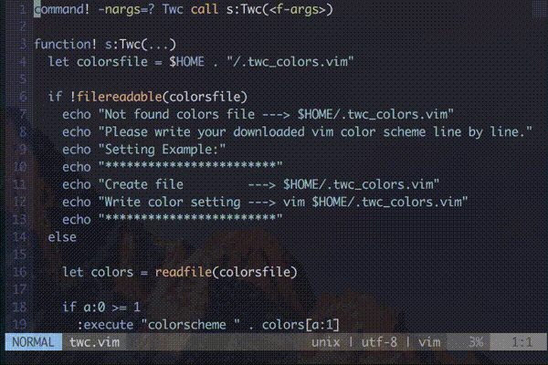

# twc.vim
Today(This) Window Color at my Vim




## Usage

loaded plugin then this command at vim!

```vim
:Twc   "---> random select your colors
:Twc0  "---> select your color
:Twc 1 "---> select your color
```


## Install
Installation can be done in these ways.

### vim-plug

```vim
Plug 'shinshin86/twc.vim'
```

### dein.vim

```toml
[[plugins]]
repo = 'shinshin86/twc.vim'
```

### NeoBundle

```vim
NeoBundle 'shinshin86/twc.vim'
```

## Setting

Add the following variables to your `.vimrc` file.  
The array should be set to the color scheme to be used.

```vim
let g:twc_colors = ["blue", "darkblue", "default"]
```

### Using setting file.

**If you have prepared a configuration file, this setting will take precedence.**

It is also possible to create a separate configuration file.  
Please write your vim color scheme line by line.

```bash
vim $HOME/.twc_colors.vim
```

`.twc_colors.vim`

```vim
blue
darkblue
default
```

`:Twc` command

```vim
:Twc 0 "---> blue
:Twc 1 "---> darkblue
:Twc 2 "---> default
:Twc   "---> random select color scheme
```

## Licence

[MIT](https://github.com/shinshin86/twc.vim/blob/master/LICENSE)

## Author

[Yuki Shindo](https://shinshin86.com/en)